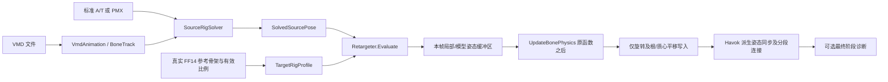
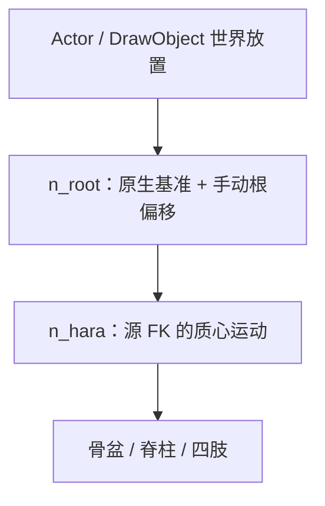

# FFMMD 开发交接文档

版本基线：**1.1.6 / AssemblyVersion 1.1.6.0**  
交接日期：2026-10-06  
目标读者：接手音乐等附加功能的 AI Agent、插件开发者、动画算法维护者

## 1. 当前结论与接手范围

FFMMD 是 Dalamud 插件，在 FF14 的 GPose 中直接导入 VMD，采样并解算源 MMD 骨架，再驱动游戏人形骨架。**运行不依赖 Blender。** 默认内置标准 MMD A/T 骨架；可以导入源 PMX 骨架，提高模型结构匹配程度。

用户在 1.1.6 交付后明确反馈：**“ok 很成功”**，随后决定交给其他 Agent 开发音乐等附加功能。它是当前角色和当前素材的实机成功基线。此前文档里的“1.1.6 新视觉待验收”属于交付当时的状态，现由这条用户反馈更新。

这不代表任意种族、体型、模组、VMD/PMX 或附着对象都完成验收。骨架重定向仍包含近似，尤其是三节源手指压缩到两节游戏手指、参考源模型不匹配、辅助形变骨和足部落点。

**本次接手应优先保持已成功的动画核心，附加音乐及其他独立功能。音乐、镜头、表情、物理均尚未实现播放。** 本文后半部分的音乐架构是建议，不能误读成已有实现。

### 用户已经确定的产品约束

1. **禁止用缩放 FF14 骨骼来适配 VMD。** 包括身体、辅助骨和其他骨架分段。原生非单位缩放可以保留，不能一律重置成 1。
2. 让源动作适配目标实际骨长；允许脚离地，不拉长腿去强行追落点。
3. **不要固定 `n_hara` 高度。** 它承担质心／骨盆升降，蹲起、跳跃必须正常。
4. 使用 `n_root` 的原生放置基准及固定根偏移控制相对放置高度，消除水平运动混入竖直方向的错误。
5. 已成功的颈部、主臂、拇指和左手不能被附加功能开发顺带重写；右手镜像修正必须保留。
6. 播放和求解应支持任意跳帧、暂停与循环；姿态计算不依赖上一帧累计状态。
7. 标准源骨架是近似适配。Kaito PMX 是验证／用户实际测试的源样本，不认定为 bibbidiba 的原模型。

## 2. 工作位置、交付物与版本权威性

当前工作源码根目录：

```text
C:/Users/bubble wine/Documents/Codex/2026-10-05/https-github-com-oedosoldier-endfield-poser/work/FFMMD
```

当前 workspace 根目录：

```text
C:/Users/bubble wine/Documents/Codex/2026-10-05/https-github-com-oedosoldier-endfield-poser
```

用户原材料位于 `E:/mmd`，历轮诊断还来自 QQ 下载目录；这些原件没有被修改。工作副本与中间分析位于 `work/`，用户交付位于 `outputs/`。

本文件中的源码路径都以 **FFMMD 源码根目录**为基准，便于解压到其他机器后使用。不要将本机绝对路径硬编码到插件。

| 文件／目录 | 用途 |
|---|---|
| `DEVELOPER_HANDOFF-v1.1.6.md` | 当前详细开发交接，包含用户成功反馈和后续接入建议 |
| `HANDOFF.md` | 当前简短交接入口 |
| `RELEASE-v1.1.6.md` | 1.1.6 交付时的变更与操作说明 |
| `HANDOFF-v1.1.5.md` 等 | 历史结论；部分方案已被后续撤回 |
| `HANDOFF-LEGACY.md` | 原 GLM 交接，存在已证实错误，不能作为当前算法事实来源 |
| `vendor/ECommons/LOCAL_PATCHES.md` | 固定第三方依赖版本和本地兼容改动 |

本地 Git 中仍有大量本轮实现的修改／新增文件，**不能假设当前代码已提交或远端已经更新**。`git status` 会看到这些变化。以当前源码文件及交接源码包为基线，接手时先保存可回退副本，不覆盖成原始旧提交。

## 3. 工程地图：先读哪些文件

| 路径 | 责任及关键入口 |
|---|---|
| `FFMMD/Plugin.cs` | 初始化、配置备份／迁移、UI 和 `/ffmmd`、卸载 |
| `FFMMD/Configuration.cs` | `Config`、`Calibration`、`Normalize()` |
| `FFMMD/UI/MainWindow.cs` | 目标选择、文件选择、播放控件、适配参数和诊断按钮 |
| `FFMMD/Player/VmdPlayerService.cs` | 时间轴、状态、GPose 目标身份、缓存准备、实际写入协调 |
| `FFMMD/Vmd/VmdParser.cs` | VMD 二进制数据与格式验证 |
| `FFMMD/Vmd/VmdAnimation.cs` | `VmdBezierCurve`、`BoneTrack`、`VmdAnimation`，包括采样和 IK 开关 |
| `FFMMD/Retarget/SourceRigDefinition.cs` | 标准 A/T 源骨架、PMX 骨骼／IK 元数据及验证 |
| `FFMMD/Retarget/PmxRigReader.cs` | PMX 骨架读取；不导入网格、纹理或物理 |
| `FFMMD/Retarget/SourceRigSolver.cs` | 源 FK、追加变换、足／足尖 IK、限位 |
| `FFMMD/Posing/SkeletonData.cs` | 无游戏依赖的目标骨架数据、参考级联 |
| `FFMMD/Posing/SkeletonTree.cs` | 从真实 Havok 骨架读取绑定参考数据 |
| `FFMMD/Retarget/TargetRigProfile.cs` | 原生参考朝向、有效角色比例、解剖／地面坐标基 |
| `FFMMD/Retarget/RigMath.cs` | 四元数运输、反射、双骨几何、Euler 限位等 |
| `FFMMD/Retarget/BoneMap.cs` | MMD 名称候选与 FF14 骨名绑定表 |
| `FFMMD/Retarget/Retargeter.Core.cs` | 纯托管重定向、整体放置、腿部及输出缓冲区 |
| `FFMMD/Retarget/Retargeter.UpperBody.cs` | 臂捩角色、辅助骨旋转、拇指／手指参考校正 |
| `FFMMD/Retarget/Retargeter.FourFingers.cs` | 非拇指四指的关节合并、闭合／张开与镜像 |
| `FFMMD/Retarget/FingerJointMath.cs` | 合成弦方向及保守关节限位 |
| `FFMMD/Retarget/Retargeter.cs` | 游戏缓存匹配、有效尺寸读取、选择性 Havok 写回 |
| `FFMMD/Retarget/RigWritePolicy.cs` | 仅允许旋转／明确平移的写入命令、缩放审计 |
| `FFMMD/Posing/NativePoseWriter.cs` | 实际 native 组件赋值；没有 Scale 写入 |
| `FFMMD/Posing/PartialPoseBridge.cs` | 身体更新后传播其他分段的已识别连接根 |
| `FFMMD/Posing/BoneApplier.cs` | UpdateBonePhysics 后写入 Hook、可选最终阶段观察 |
| `FFMMD/Retarget/RigDiagnostics.cs` | schema 5 的源／目标／三阶段／放置诊断 |
| `FFMMD.Test/` | 同源纯托管离线验证及真实骨架／现场回归 |

推荐阅读顺序：`VmdPlayerService` → `Retargeter.Core` → `SourceRigSolver` → `TargetRigProfile/RigMath` → native 写入，再看手指与诊断。音乐开发首先关注时间轴和状态，不必改 IK。

> 历史辅助字段有的已不参与运行，例如 `BoneMap` 的旧辅助表、`MmdBinding.Amp` 和 `VmdAnimation.CameraOrCenterTracks`。后者只是骨骼轨道转 List，不是镜头轨道。不要依据旧名称推断功能已完成。

## 4. 每个游戏帧的数据流



实际调度分两部分：

- **Framework Update：**更新时钟、处理文件加载、重新识别目标、准备骨架／比例缓存、求解指定 VMD 帧。
- **native post-hook：**原游戏函数先运行，再核验目标身份并复制已经准备的姿态；同步模型空间和其他分段连接。

Hook 可能同帧调用多次，所以写入是幂等的。**不在 Hook 内推进时间、不以 Hook 次数计算动画帧。** 求解、映射建立和普通文件 I/O 均不放到常规 native 写入路径。诊断捕获是例外的一次性工作，JSON 落盘仍在 Tick。

## 5. 时间轴、播放状态与帧采样

### 5.1 时钟

`VmdAnimation.FramesPerSecond = 30f`。MMD 帧号是素材时间单位，不是游戏渲染 FPS：

```text
sourceFrame = TimeSec * 30
TimeSec += elapsedStopwatchSeconds * Config.Speed
```

`TimeSec` 为 double，采样帧最终转为 float。游戏 60/120 FPS 时会采样非整数 VMD 帧。现有时钟采用 `Stopwatch.GetTimestamp()`，避免低精度毫秒计数引起抖动。

时间仅在 `Playing && !Paused && Anim != null && IsGPosing && TargetValid` 时推进。骨架求解失败不会自动建立一个新的音频时钟；目标失效导致不再推进，下一次 Tick 仍更新时间戳，因此不会补跑整段失效期间的墙钟时间。

### 5.2 状态语义

| 操作／事件 | 当前实际行为 |
|---|---|
| 成功 Load | 新动画、时间 0、Playing/Paused=false，清理姿态准备与源缓存 |
| Play | 要求 GPose；Playing=true、Paused=false、姿态激活；若已到末尾则从 0 开始 |
| Pause | 切换 Paused；时间停止，已激活姿态继续保持 |
| Stop | 时间 0、Playing/Paused=false、姿态覆盖停用；不是“求解第 0 帧并保持” |
| Seek | 钳制到 `[0, DurationSec]`，激活姿态预览、取消 prepared；不自动设置 Playing |
| 播放自然到尾，Loop=false | 时间钳到结尾，Playing=false，**姿态仍保持最后一帧** |
| Loop=true | `TimeSec %= DurationSec`；没有额外 loop 事件总线 |
| 退出 GPose | Stop |
| 目标暂时无效 | 停止准备／写入和时间推进；不一定把 Playing 置 false |
| 导出诊断 | 暂停并 Seek 当前时间，等待写后／最终姿态，超时约 3 秒 |
| 切换源 PMX／标准骨架 | Stop，重新建立源定义与适配 |

这些差别直接影响音乐：到尾保持姿态与手动停止、预览 Seek 与播放 Seek、目标暂停与用户暂停应区分。不要只监听 `Playing` 一个 bool。

### 5.3 VMD 格式与插值

- 骨名为 Shift-JIS 932；支持 `Vocaloid Motion Data 0002` 的 20 字节模型名和旧头的 10 字节模型名。
- 骨骼记录含位置、四元数与 64 字节插值数据，**没有骨骼 Scale 轨道**。
- X/Y/Z/R 四通道控制点为 `data[c]、data[c+4]、data[c+8]、data[c+12]`，控制值除以 127。
- 区间 `[a,b]` 使用**终点关键帧 b 的插值曲线**。先解 `BezierX(t)=时间比例`，再取 `BezierY(t)`；旋转使用该 R 曲线结果做 Slerp。
- 非线性曲线先 Newton，必要时二分；曲线在排序时预解析，普通采样无分配。
- 重复帧稳定地采用最后记录；首个关键帧之前返回首帧，最后之后返回末帧。
- 非有限数拒绝；零四元数回退单位旋转；归一化前做幅值保护。
- 名称按 FormKC 规范化，并将 `人指` 变体转为 `人差指`，IK 全角／半角名称可对应。

解析器还读取 morph、camera 和显示／IK 数据，跳过灯光、自阴影。**读取不等于播放。** `VmdAnimation.Build` 保留骨骼、morph 列表及 IK 开关；镜头未进入播放层，显示可见性 `Show` 也未用于 actor 隐藏。`MaxFrame` 综合骨骼、morph、IK 帧，当前没有综合镜头时长。

`Player.Load` 拒绝没有骨骼轨道的纯表情／镜头 VMD。将来开发镜头需显式保留 camera 数据并定义时长，不能仅增加 UI 按钮。

## 6. 源骨架：为什么必须先解算 MMD

VMD 是某个源骨架的控制动画，不是 FF14 关节的最终姿态。标准 MMD 舞蹈中，腿、膝和踝的直接旋转可能始终为单位旋转，动作实际通过足 IK 解出。bibbidiba 就是这一类，关闭 IK 会丢失腿部动作。

错误旧方案把足 IK 控制骨位移乘系数后当作 FF14 脚踝目标，省略源父链、源骨长、弯曲限制和足尖。当前管线先产生 `SolvedSourcePose`，再适配目标。

### 6.1 定义与数据

`SourceBone.RestPosition` 是源模型空间的**绝对参考位置**。父相对参考平移由两者相减得到。源 PMX 骨架的参考旋转在此实现中按单位旋转约定。

定义包含 Name、Parent、Layer、Flags、AppendParent/Ratio、FixedAxis、LocalAxisX/Z、TailBone/TailOffset，以及 IK controller/effector、链接、迭代数、每步角度、局部 Euler 限位。

标准骨架包含全亲、中心、groove、腰、上下半身、腿／膝／踝／趾、足 IK 亲与足尖 IK、D 形变腿／足先 EX、肩 P、臂捩、手捩、手腕与手指。A/T 主要改变上臂／前臂参考方向；标准手掌与拇指是近似参考，fingerprint 为 standard-a/t-v2。

### 6.2 PMX 读取边界

支持 PMX 2.0/2.1、UTF16/UTF8 和 1/2/4 字节索引宽度。跳过网格、纹理与材质区后读取骨架；不将网格载入 FF14，不依赖 Blender。

限制包括文件不超过 512 MB、骨骼不超过 8192、依赖深度不超过 256、IK 链长不超过 256、迭代不超过 4096，并限制估算总求解量。校验有限值、父／追加／尾索引、环、限位和 effector 祖先关系。

物理后变形层与外部亲保留标记并显示警告。**不运行 MMD 物理、不提供外部亲实际变换、不实现骨骼 morph。** 局部编辑轴元数据不直接当作非单位 bind rotation。这里是受限的源骨架求解器，不是完整 MMD 引擎。

PMX 关联到具体 VMD 路径：重载同一 VMD 时可恢复该 PMX，换动作不盲目沿用。失败保留此前有效源定义，但播放器已停止并显示错误。

### 6.3 FK 与追加变换

用 `R` 表示旋转，`p` 表示位置，`r_i` 表示绝对参考位置：

```text
localPosition_i = r_i - r_parent + sampledTranslation_i + appendTranslation_i
localRotation_i = IKCorrection_i * sampled/appendRotation_i
modelPosition_i = modelPosition_parent + Rotate(localPosition_i, modelRotation_parent)
modelRotation_i = modelRotation_parent * localRotation_i
```

追加旋转／位移按标记和权重处理，旋转权重用四元数 Power（支持负权重）。固定轴将旋转向量部投影到允许轴。父链和追加依赖用拓扑顺序，IK 控制器按物理后标记／Layer／索引排序。

每次 Evaluate 都重新采样并重置 IK 修正，不拿上一帧姿态做累积基础。源 World 级联也会随 IK 修正重算，以便后代和追加骨跟随。复杂 PMX 的变形顺序、追加语义不应被宣传成已对所有模型逐项验证。

### 6.4 IK 与足尖

`LegIkMode`：0 关闭、1 强制、2 按 VMD 开关。没有开关轨道／未到首个开关前默认启用；迭代数为 0 的链不解算。

符合双链接和角度预算条件时用解析双骨解，再在 link-local 空间应用限位；必要时用有界 CCD 补残差。其他链直接 CCD，单步角度由 PMX 约束控制。

双骨除“对准大腿”还需对齐膝盖铰链平面，否则 X 轴限位会与错误长轴扭转冲突。退化时使用参考方向和当前父朝向，不依赖上一帧。完全直腿短目标的 CCD 零梯度，用允许方向的小弯曲确定性启动。

足 IK 亲通过真实父链生效。足控制骨的旋转移动其足尖控制子骨，足尖 IK 再解踝朝向；**不把足控制四元数直接赋给踝。** `SolvedSourcePose` 输出所有已解关节位置／旋转、局部姿态、IK targets、启用状态和膝盖平面。

## 7. 目标骨架与数学约定

目标来自 `hkaSkeleton.ReferencePose` 与当前 `hkaPose`，不是一个硬编码 FF14 T 姿态表。

`SkeletonTree.Build` 读取骨名、父索引和 bind 变换。`TargetRigProfile` 保留 bind 朝向，但采用当前角色有效 local translation/scale 计算比例；根与 `n_hara` 平移保留参考值，防止把正在播放的 root/center 位移误当角色尺寸。

```text
TargetModelRotation_i = TargetModelRotation_parent * TargetLocalRotation_i
TargetModelScale_i = TargetModelScale_parent * TargetLocalScale_i
TargetModelPosition_i = TargetModelPosition_parent
    + Rotate(TargetLocalPosition_i * TargetModelScale_parent, TargetModelRotation_parent)
```

目标 scale 参与读取与几何计算，**不意味着允许写 scale**。改变体型／骨架／有效主要骨长度或缩放时重新建缓存。肩肘辅助叶骨的动态体积缩放不触发整套比例重建，避免每帧无意义分配。

数学采用 `System.Numerics`。`Matrix4x4` 的向量变换按当前代码行向量约定；四元数乘积 `q_parent*q_local` 表示先 local 再 parent。不要把另一个引擎的列向量公式不经转换搬进来。

### 7.1 正交坐标变换与反射

`RigCoordinateMap` 验证正交单位基，位置向量用矩阵 C。若四元数为 `(v,w)`，旋转运输使用：

```text
q' = Normalize( det(C) * C(v), w )
```

这里的 `det(C)` 是 ±1 的手性符号。反射不能靠“某个 Quaternion 分量乘 -1”或全局 Z180 代替。独立测试验证 `C(Rv)=R'(Cv)`。

### 7.2 当前有两种明确用途的基

| 坐标基 | 用途 | 竖直方向 |
|---|---|---|
| 解剖参考 `CoordinateMap` | 关节朝向、腿姿、手指参考适配 | 由源／目标解剖参考构造；可包含曲线倾斜 |
| 地面放置 `GroundCoordinateMap` | 整个人物移动、root 朝向 | 明确为源／目标模型 Y-up；left/back 在 XZ 平面 |

它们分别服务关节参考和人物放置；每个基内部同时支持向量／旋转运输。**头到骨盆的连线不是地面法线**，不能再拿它去转换整段平移。

## 8. 逐骨朝向重定向

`BoneMap.Bindings` 查找目标候选与源名称。腿部优先使用存在的足 D／膝 D／踝 D 和足先 EX，包含求解后的继承及各自关键帧。

`MappedBone.SourceIndex` 是位置／语义角色；`OrientationSourceIndex` 可不同，例如上臂朝向包含源臂捩，前臂包含手捩。不要把角色位置和朝向索引混为一谈。

初始化参考校正时，寻找最近的、同时满足源／目标祖先关系的已映射后代，比较参考方向，形成 `_aligned`。必要中间父链只覆盖参考旋转，以保证准备姿态和 native 级联同义。

root、spine、neck、head、finger 例外处理：root 不做根到骨盆方向的强制倾斜；脊柱／颈／头保持原生曲线；手指走专用适配。踝参考保留鞋／脚原生方向关系。

通用映射大意为：

```text
desiredModel_i = Transport(sourceSolvedModelRotation) * targetYaw * alignedReference_i
desiredModel_i = Power(desiredModel_i * inverse(targetBindModel_i), amplitude) * targetBindModel_i
localOutput_i  = inverse(currentTargetParentModelRotation) * desiredModel_i
```

`amplitude` 在 0–1；0 返回绑定姿态，1 完整适配。这里使用**本帧当前父骨**，不是 bind 父骨。source model 朝向中已包含控制父链和中间骨，不能再次把父级动作随意累乘一次。

## 9. 腿部：方向、弯曲和平面优先

目标原生链包含 `j_asi_a → j_asi_b → j_asi_c → j_asi_d`。不能假设 thigh 与 knee 相邻；`j_asi_b` 的平移／缩放参与几何。

设源上／下腿向量为 `u_s`、`l_s`，目标实际上／下腿长度为 `L1`、`L2`：

```text
cosBend = dot(normalize(u_s), normalize(l_s))
targetReachLength = sqrt(L1² + L2² + 2 L1 L2 cosBend)
targetReachDirection = Transport(normalize(u_s + l_s))
targetAnkleGoal = targetHip + targetReachDirection * targetReachLength
```

源上腿在 reach 方向的垂直分量提供弯曲方向／膝盖平面。按目标长度再做双骨求解，调整 thigh/knee 旋转并保留已转移的踝朝向。反射下平面法向按手性处理；退化方向有参考 fallback。

这在完整幅度、非退化样例中保持源方向／膝角／平面。**不承诺按不同体型保持原脚落点。** 幅度小于 1 时混合目标位置／弯曲方向，不等同严格线性插值膝角。

自动“位移系数”来自左右有效腿长比的平均，不再是“腰高除以 10”。它只换算整体运动单位，不是写骨骼缩放，也不是用来放大脚 IK 控制轨道。

## 10. 整体放置与高度：1.1.6 的最终规则

### 10.1 `n_root` 与 `n_hara`

`HeightRootIndex` 当前选择目标第一根无父骨；标准 FF14 人形中即 `n_root`。`CenterBoneIndex` 优先 `n_hara`，其次 `j_kosi`。



目标 root 原生模型 Y 在当前样本为 0，靠近 Actor 放置原点。它可用作放置锚点，**没有证据把骨骼本身等同物理碰撞箱**。没有地形射线、鞋底测量或自动脚接触约束。

### 10.2 不锁质心，消除的是错误坐标泄漏

源下半身 global 位置相对其参考位置的差是整体运动输入。首帧只去掉一个共同水平锚点，不消掉初始 Y，也不为左右脚计算独立中位数：

```text
initialTravel = sourceSolvedPelvis(0) - sourceRestPelvis
startTravel   = (initialTravel.X, 0, initialTravel.Z)
travel(t)     = sourceSolvedPelvis(t) - sourceRestPelvis - startTravel
authored(t)   = GroundMapYaw(travel(t)) * positionUnitFactor * amplitude
desiredCenterBeforeHeight = targetBindModelCenter + authored(t)
```

计算当前父骨转动后的 center 模型位置，再从 desired 减去它，反算到 parent-local 平移：

```text
offsetModel = desiredCenterBeforeHeight - currentCenterModelPosition
offsetLocal = Rotate(offsetModel, inverse(currentParentRotation)) / parentModelScale
centerLocalTranslation += offsetLocal
rootLocalTranslation.Y += HeightOffset
```

因此根转动的影响只计一次，center 仍跟随源下蹲／跳跃。GroundMap 的水平输入不会产生 Y。手动偏移与动作幅度独立，只移动整个模型。

`LockHeight` 是撤回方案的旧序列化兼容字段，`Normalize()` 强制 false，运行不使用，UI 已移除。**不要因看到这个字段而恢复 1.1.5 的固定质心行为。**

root 朝向使用 ground map，不再将 root→pelvis 的参考方向强制对齐到斜的源骨架，从而避免凭空给 root 添加约 9° 倾斜。

### 10.3 世界关系的诊断边界

`PlacementSnapshot` 只读 Actor Position 与 DrawObject Position/Rotation/Scale，单独记录 root／center 模型高度。图形对象没有父对象时：

```text
worldPoint = DrawPosition + Rotate(modelPoint * DrawScale, DrawRotation)
rootRelativeToActorY = rootWorldY - ActorPosition.Y
```

Actor 的放置 Y 作为当前参考，**不是实测地形高度**。图形对象有父对象时不假装完成父链合成，WorldY 留空。插件不写 Actor 世界变换或碰撞体。

## 11. 颈部、臂部和手指

### 11.1 颈部／脊柱

早期以源中立直线强制校正目标颈部，改变了原生参考曲线与头颈关系，造成拉伸外观。现在保留 FF14 spine/neck/head reference，仅转移动作增量。皮肤拉伸外观不等同 Scale 数值改变，需查看 before/after 数据。

### 11.2 主臂扭转与形变辅助骨

源 `腕捩`、`手捩` 在真实 FK 父链中影响后代；其已解朝向用于对应主臂朝向角色。FF14 的 `n_hkata`／`n_hhiji` 在现场是叶节点形变骨，不能当成源扭转链父关节直接赋控制朝向。

辅助骨旋转按当前主骨计算：上臂辅助抵消约一半长轴 twist；肘辅助在当前 forearm-local 中抵消约一半关节变化，并乘回其参考旋转。只用于确认结构的辅助叶骨，保留原生平移与缩放。这是适配策略，不是已复刻 FF14 全部皮肤体积算法。

### 11.3 拇指

thumb 单独保留 1.1.4 成功策略。目标近节映射源 `親指1`（包含父 0 的累计），远节映射 2。在 source wrist 空间取相对旋转，通过指向／掌面校正运输，然后跟随当前目标 wrist。中立姿态保留 FF14 原生拇指张开关系。

单独旋转手腕不应额外弯曲拇指；整体偏航不应改变其局部动作。这些已有独立检查。

### 11.4 其他四指

源通常有三节，目标有两节。源 2/3 的全部旋转直接累乘到目标远节，在抓握时会出现近 180° 或更大反折和轴向扭转。因此四指使用有界语义适配：

- 常规 MMD Z 控制提取弯曲，Y 提取有限张开。
- target 近节只施加弯曲／张开，远节只施加弯曲，不直接转移长轴滚转自由度。
- 三节压两节时，用源中节／末节的长度加权合成弦确定远节角：

```text
equivalent = middleAngle
    + atan2(tipLength * sin(tipAngle), middleLength + tipLength * cos(tipAngle))
```

例如等长两节各 90°，合成方向是 135°，而不是累加后的 180°。末端长度优先 PMX tail reference；无可靠值时取中节的 .65。它不是 mesh 指尖测量。

保守限位：近节弯曲 95°／伸展 15°，远节弯曲 110°／伸展 10°，张开 20°。这是插件近似策略，不是游戏硬限制。不同模型非标准轴、特殊握物动作仍可能需要后续适配。

### 11.5 最容易再次犯错的左右手符号

MMD 常规源控制闭合符号左右相反；当前 FF14 样本的**两侧 native 指骨都是负本地 Z 闭合**。右手参考是镜像，叉积只能确定平面法线，不能直接把法线当掌心方向。

1.1.6 对右手掌面手性修正，右手 curl 符号翻转；spread 与 curl 独立，张开保持原符号。不能为了修 curl 再把 spread 一起翻转。

旧“两个手掌都用 wrist-local -Z”的测试假设已撤回。现在有真实 native `BeforeWrite` 握拳数据、左右镜像掌面与最新现场左手保持／右手反转测试。

## 12. Havok 写入、分段及对象生命周期

### 12.1 写入能力

`RotationTranslationWrite` 只有 Quaternion、Vector3 及组件开关，**没有 Scale 字段**。`NativePoseWriter.Apply` 只赋旋转／获准平移。

身体旋转按 `_writes` 掩码写：映射骨、必要未映射父链／中间腿骨和确认的臂部辅助叶骨。身体平移仅允许 root 和 center；其他骨平移、所有 scale 保持 native 值。求解缓冲区里有其他骨参考值不意味着它们全被写回。

先 `SyncLocalSpace()`，通过 `AccessBoneLocalSpace` 修改，再 `SyncModelSpace()`。让 Havok 管理 dirty flags 与派生姿态，不手工把两个缓存都标成已同步。

### 12.2 其他 partial

身体采用 partial 0、pose index 0。其他分段缓存：单根使用 native ConnectedParentBoneIndex/ConnectedBoneIndex，多根按骨名找到身体连接。变更指针、数量或连接字段会使缓存失效。

身体更新后只传播连接根的模型 position/rotation，通过 Propagate 与同步保留后代相对姿态；**不复制完整 transform、不覆盖根或后代 scale**。这不是完整武器／附件／表情／物理驱动器，也没有实现所有 4 个 Havok pose 的选择策略。

### 12.3 Hook 时序与签名

`BoneApplier.Detour` 先调用 Original，再调用 `ApplyTo()`。忽略其 a1 参数，不假定它就是目标 CharacterBase。目标每次重新解析、验证。

UpdateBonePhysics 签名：

```text
48 89 5C 24 ?? 48 89 6C 24 ?? 48 89 74 24 ?? 57 41 54 41 56 48 83 EC ?? 48 8B 59 ?? 45 33 E4
```

可选 FinalizeSkeletons 观察签名：

```text
40 53 57 41 54 41 55 48 83 EC ?? ?? 48 ?? ?? ?? ?? ?? ?? ?? 4C
```

它是骨架最终处理观察，不是 GPU／视频像素读回。最终签名失效可降级继续播放，报告中最终姿态为空。游戏更新后可能需重新核查签名与时序，不因 API 编译通过就认定兼容。

### 12.4 GPose 身份与同步

播放仅选 Human CharacterBase；GPose actor 区间按 201–439 查找，自己模式找 GPose 副本，不能驱动场外原角色。

保存地址与 ObjectIndex/GameObjectId，每次写入前重新查对象表、检查 Valid、地址、ID、当前 CharacterBase、骨架指针及姿态长度。换模型、换目标、退出／目标销毁不能继续使用旧指针。

Tick、Apply、最终捕获和调试求解共享 `_poseLock`，`_poseActive/_prepared` 为 volatile。停止／未准备的 native 路径先返回，避免文件解析期间等待 pose lock。普通求解热路径有零分配检查；这是求解器性质，不是整个 UI/插件在游戏中的零分配保证。

## 13. 诊断：定位问题所需证据

导出按钮暂停当前时间，等待 native 写入后和最终观察，约 3 秒超时。JSON 写入插件配置目录 `diagnostics/`，文件名含时间与帧号。

schema **5** 主要字段：

| 字段 | 含义 |
|---|---|
| SourceBones/SourceIkChains/SourcePose | 源定义、已求解关节、IK 目标／平面等 |
| Target / SourceBindings / OrientationSourceBindings | 目标参考、有效尺寸、写入掩码及两种源角色 |
| Prepared | 纯算法本帧输出 |
| BeforeWrite / AfterWrite / FinalRender | 身体 native 三阶段快照 |
| BeforePartials / AfterPartials / FinalPartials | 分段连接与姿态 |
| AnimationScaleWritesAllowed | 固定为 false |
| DuringWriteScaleAudit / FinalStageScaleAudit | 写入期间和后续处理分别统计；阈值 1e-5 |
| HeightAnchorY / PreparedRootY / AfterWriteRootY / FinalRootY | root 模型基准及输出；schema4 的 anchor 曾是 center，已改变 |
| PreparedCenterY / AfterWriteCenterY / FinalCenterY | 质心动态，不应固定 |
| GroundPlacementMatrix | 地面放置坐标变换 |
| Before/After/FinalPlacement | Actor/Draw 变换及可计算的世界高度 |
| FourFingerJoints | 四指近／远节、弯曲、张开、轴向角与源段长度 |

源姿态在导出时克隆，后续跳帧不会改变已捕获的 source snapshot。缺失最终观察留空并说明原因，不用 Prepared 冒充最终渲染。

当异常发生时，先区分：

1. 源 FK/IK 是否本来就错／源 PMX 不匹配；
2. Prepared 的目标几何／旋转是否错；
3. AfterWrite 是否偏离 Prepared（只比较实际写入组件，未写骨不要求相同）；
4. FinalRender 是否在之后被游戏或其他覆盖改变；
5. 骨架正确而 mesh 形变异常（需要看辅助骨、权重和原生动态体积处理）。

胸／尾在后续阶段出现原生尺寸调整已被记录，不能把它直接归为动画写 Scale。Ktisis/Brio 仅加载也不是发生冲突的证据；需要阶段对比或停用覆盖对照。

## 14. 配置、版本与兼容

插件版本 1.1.6 与 `RigPipelineVersion=5`、诊断 `SchemaVersion=5` 是不同概念，不要联动盲改。

`Config.Normalize()` 范围：Speed .25–4、MotionScale 0–1、Yaw -180–180、ManualPositionScale 0–.5、HeightOffset -3–3。旧 RotateX/Y/Z180、MedianBaseline、RetargetMode 保留兼容但不参与当前算法；`LockHeight` 强制 false。

自定义配置存在插件配置目录的 `FFMMD.json`，使用 System.Text.Json `IncludeFields=true`。新增选项默认值需明确，迁移保留用户已成功的播放、PMX 关联、朝向、根偏移。备份失败不能覆盖原文件。普通 UI 改动 ConfigDirty，约 3 秒节流 Save。

音乐配置应独立添加 MusicPath、Volume、Offset、Enabled 等，不挪用 MotionScale 或 ManualPositionScale。改变音频状态不应导致每帧重新 Initialize 骨架。

## 15. 构建、依赖与交付

当前基线：.NET SDK 10.0.100（global.json 允许 latestFeature）、Dalamud.NET.SDK 15.0.0、API level 15、Windows/x64、unsafe。开发库优先检测：

```text
%APPDATA%/XIVLauncherCN/addon/Hooks/dev
%APPDATA%/XIVLauncher/addon/Hooks/dev
```

ECommons 固定源码 3.2.1.22，提交 `9ef3961c329fa99bd4c65769b39a56cbe2d2917a`，随源码提供。仅记录的一处兼容 patch 为 QuestDialogueText 显式别名 `Lumina.Excel.ExcelPage`，避免与 FFXIVClientStructs 冲突。无需外部 MoodlesPlus 工作副本。

在源码根目录：

```powershell
./build.ps1 -TestVmd 'E:/mmd/bibbidibaFull_DanceMotion.vmd' -TestPmx '<验证 PMX 路径>'
# 可指定 -DalamudPath、-DotnetPath、-PackageCachePath
dotnet run --project FFMMD.Test -- --verify '<VMD 路径>'
```

`FFMMD_TEST_PMX` 环境变量用于单独运行的真实 PMX 检查。TestPmx 是可选；没有外部素材的测试数会减少，不能宣称执行了相同的 110 项。

`build.ps1` 先 restore/test，再 restore/build 插件；失败不打包。SDK 产物为 `FFMMD/bin/Release/FFMMD/latest.zip`。交付安装包另附 README、GPL LICENSE、ECommons LICENSE；源码包去掉 `.git/bin/obj/.build` 和原始媒体／模型，不随包复制本机 Dalamud 或 NuGet 缓存。

现有 Release 成功，0 错误、1 NU1900 网络警告：NuGet 漏洞元数据服务不可达。未关闭审计，不能声称已完成漏洞元数据核查。

项目保留 GPL-3.0。新核心独立实现，参考 Endfield-Poser 的求解思路及 Brio 的游戏同步入口；没有复制 Endfield AGPL 核心。选用新音频库时，后续开发者需另核查版本、许可、.NET 10 与 native 部署方式。

## 16. 验证材料与实际验收状态

最新完整离线检查 **110/110**：

| 组 | 数量 | 主要内容 |
|---|---:|---|
| 基础检查 | 14 | 格式／采样基线 |
| RegressionSuite | 13 | 独立二进制格式、曲线、异常／边界 |
| PipelineRegression | 33 | 源 FK/IK、参考、PMX、腿几何、退化、零分配等 |
| AcceptanceRegression | 19 | 172 骨现场、脖子／臂／拇指、原生缩放审计 |
| FingerHeightRegression | 18 | 四指合并、镜像掌面、根放置与旧字段撤回 |
| RightHandGroundRegression | 13 | native 双手负 Z、最新左右反馈、地面基、根／质心分离 |

测试直接编译生产纯托管源码，native 实际写入与 Hook 不通过假游戏结构宣称已验证。真实目标包含 AnimationKit 提取的 186 骨、现场 172 和 106 骨；最新 source fingerprint 与 Kaito PMX 匹配。

bibbidiba：27282 骨关键帧、207 轨道、最大帧约 4891（30 FPS）。腿直接旋转依赖 IK，不能拿这些单位旋转当文件错误。旧格式尾段是标准内容，不再引用“非标准尾段”“179° 必然错误”等旧结论。

全段检查是**每 7.5 或 15 帧抽样**，另加具体帧；不是每个整数帧，更不是逐像素视觉真值。非退化腿姿转移 <1°、辅助链终点 <.001 是几何检查；不自动证明源模型与原 MV 一致。

重点实机时间：26.16、31.17、41.17、46.17 秒；后续抓握／高度为 58.96、86.56、142.61 秒。真实回归 JSON 省略身份、机器路径和时间戳。

**最新用户反馈确认 1.1.6 很成功，可在这一基线上扩展。** 没有新 schema5 JSON 并不推翻这个用户验收，但也不能凭反馈扩大为全种族、全模型、全世界放置证明。

## 17. 必须记住的开发历史

| 阶段 | 结果／已撤回的假设 |
|---|---|
| 原 GLM／旧工作 | 有格式与骨架假设错误，交接结论需独立核对 |
| 1.1.2 | 41 检查主要证明数值与级联一致，未证明腿动作还原 |
| 1.1.3 | 重建“源求解 → 目标适配”；腿基本成功，上身与手指仍异常 |
| 1.1.4 | 颈／臂／thumb 基本修好；四指直接累计仍反折，下移问题未解决 |
| 1.1.5 | 四指限位与合并；左手成功，右手镜像方向反了；锁 n_hara 方案错误 |
| 1.1.6 | 右手闭合与 spread 分离；root/ground 放置、恢复 center 升降；用户确认成功 |

禁止重新引入：全局翻轴代替逐骨参考、左右脚独立中位数、固定腰高除 10、为了追落点缩放骨骼、完整 transform 分段复制、手工双缓存同步标记、直接映射 MMD 扭转控制到 FF14 辅助叶骨、固定 `n_hara`。

## 18. 音乐扩展：接入方案建议，尚未实现

> **2026-10-06 更新：**本节方案已按"插件直接播放"路线落地为 **v1.2.0**（`AudioTransportLogic` + `VariableSpeedSampler` + `MusicService`，`TransportChanged` 事件收口控制点），wav/ogg/mp3、同步变速（变调）、按动作关联记忆均已实现，附 23 项离线回归（`FFMMD.Test/MusicRegression.cs`）。详见 `RELEASE-v1.2.0.md`。下文保留作为设计依据；SCD 打包/游戏资源替换路线仍未实现。

### 18.1 先统一状态边界，保持现有时钟

当前 Player 不是可直接订阅的多媒体 transport：TimeSec/Playing/Paused 是 public 字段，UI 直接修改 Paused；Speed/Loop 通过 Config 修改，也没有 Seek/Loop 事件接口。

建议先新增一个**不可变播放快照及明确操作通知**，集中现有控制点，再将音频作为消费者。示意（新设计，不是当前 API）：

```text
PlaybackSnapshot:
    MotionIdentity, Revision, TimeSec, DurationSec, Speed
    IsPlaying, IsPaused, PoseActive, TargetReady, IsGPosing

Transport changes:
    Load, Play, Pause, Resume, Stop, Seek, LoopWrap
    SpeedChanged, TargetSuspended, GposeExited, Disposed
```

集中 UI 的 Paused/Speed 改动时应保持第 5 节行为，尤其 Seek 后的静止预览、自然结束保持末帧和临时目标失效。将音频状态塞进 IK、BoneTrack 或 NativePoseWriter 会让职责和测试混乱。

第一版可保持现有 `TimeSec` 为主时钟，音频跟随；如果之后决定音频设备时钟为 master，那是正式的时钟架构变更，需要重新测暂停／目标失效／Speed／循环，不可偷偷同时保留两个独立自增时钟。

### 18.2 音频服务的边界

建议独立模块负责：文件检查、解码／缓存、输出设备、音量、暂停／恢复、定位、结束、错误和 Dispose。文件加载与解码不在 `_poseLock` 长时间执行，也不在 native Hook。资源成功准备后在受控线程交接。

音频错误应显示在音乐区，不改骨架、SourceRig 或运动系数。播放依旧可以作为静音动画使用；具体失败策略由新需求明确。

### 18.3 偏移量定义必须写清

可采用以下确定定义：

```text
desiredAudioPosition = animationTimeSec + AudioOffsetSec
```

正值表示跳过音轨开头，负值表示动画先播放、音频延后进入。负位置期间静音等待，不改动画 TimeSec；超过音频末尾静音或按确定结束策略处理。让用户看懂符号，避免同一个“延迟”有两个方向。

### 18.4 操作对应关系

| 动画操作 | 音频接入建议 |
|---|---|
| Load／换 VMD | 更新 motion identity；是否清除音乐关联由配置明确 |
| Play | 一次定位并开始，不每个 Hook 反复 Play |
| 用户 Pause | 暂停设备；Resume 从同一位置继续 |
| Seek | 定位一次；预览状态不自动变成播放 |
| Stop | 停止／复位音频，动画姿态覆盖照原规则停用 |
| LoopWrap | 显式定位到循环后时间，不能当作普通漂移修正 |
| 自然结束 | 停音，但允许最后姿态继续保持 |
| 退出 GPose／Dispose | 停止并释放资源，防止后台音频残留 |
| 目标失效导致时钟冻结 | 暂停或按明确策略处理；不能让音轨单独越跑越远 |
| Speed 改变 | 对音频同样定义变速策略；不通过改 VMD FPS 补偿 |

### 18.5 速度、音高与漂移

动画现有速度范围 .25–4。仅修改音频采样播放率会同时改音高；保音高的 time-stretch 需要独立实现／库支持，不能用滑条名称冒充已支持。

不要逐 Tick 硬 Seek 追位置，这会造成噪声和抖动。区分用户 Seek/Loop 的跳变与设备自然漂移；定义缓冲／延迟补偿、可接受误差和必要时校正策略。毫秒数阈值应经实际音频设备测试确定，不能只凭纸面推导。

拖动进度时可区分预览和最终定位，避免每次 UI 数值变化重建解码器。沿用 double 秒时间，换算音频 sample frame 时保留精度，不把 VMD 30 FPS 当音频刷新率。

### 18.6 音乐首轮验收

先测试同角色、已成功 VMD、一个本地音频：正常播放、重复 Play、暂停／恢复、暂停 Seek、播放 Seek、Stop、自然结束、循环、±偏移、Speed、音频短于／长于动作、目标消失／恢复、退出 GPose、卸载／重载。

至少做一个较长连续播放检验漂移，观察音频线程／解码分配／GC 不损害姿态稳定。测试骨架回归仍须通过，确认音乐没有修改 rig 或 root 高度。

## 19. 镜头、表情、其他功能的后续入口

- **镜头：**已有 raw CameraFrames，但 Player.Load 只保存 Build 后的 animation，目前丢失播放所需 camera 数据。需要 CameraTrack 与共享时间，独立确认 FF14 摄像机 API、坐标、插值和 perspective 语义；不要用 BoneMap 或 CameraOrCenterTracks。
- **表情：**MorphTracks 是读入列表，没有权重采样到 FF14 的映射。MMD morph 不能直接当某根脸骨旋转；当前 partial root 跟随也不是 facial animation。
- **音乐／镜头时长：**须明确动画、音频、镜头谁决定 transport duration，先保持已成功动画时长，避免让音乐扩展默默截短／延长骨骼播放。
- **物理：**目前没有 MMD 物理，没有危险代码段 NOP 冻结；引入之前应独立建立可撤回方案及证据，不能随附加功能顺便打开。
- **体型扩展：**增加真实目标 reference fixture 与各自实机检查，不用新的尺寸系数覆盖全族；依然不能写骨骼 Scale。

## 20. 已知边界与实现风险清单

这些是源码现状和范围，不是要求现在停工等待许可：

1. 仅人形／GPose，目标 pose 0；全 pose／附件／附着世界父链未完整覆盖。
2. PMX 追加、层和 IK 是受限实现，物理、外部亲、bone morph 不完整。
3. 四指是标准语义近似，保守限位不是逐模型 mesh 真值。
4. 对角 scale 级联不能宣称完整任意剪切变换支持；原生人体样本已验证。
5. `Load` 失败可能保留旧有效动画，同时显示新错误；音乐关联应以成功 load 的 LoadedPath/identity 为准，不能先替换后忘记失败回退。
6. Player 公开字段及部分 UI 操作尚不是完整线程安全 transport API；新后台音频线程不能任意直接写这些字段。
7. 骨架缓存建立和文件解析发生在 Tick；大型 PMX 会带来载入停顿。不要在 native 回调持锁解码音乐，后续可将纯加载工作异步化但保持交接原子性。
8. 停止依赖游戏后续正常更新恢复，没有保存并一口气回写所有 native 初始骨变换；不能假装已有完整 restore service。
9. Hook 签名／时序随游戏版本变化。编译和用户一个角色成功不是全版本保证。
10. 世界参考目前是 Actor 放置点，不是碰撞箱／地形采样；错误不能靠贴地或缩放掩盖。
11. 本地音乐路径迁移、原生解码 DLL、卸载句柄和格式支持需要新功能自己验证。

## 21. 接手执行清单

1. 解压带本交接的源码包／保存当前工作树；确认插件 1.1.6、pipeline5、schema5。
2. 阅读本文和上述源码入口，先跑现有测试，保留成功安装包可回退。
3. 将用户“1.1.6 很成功”作为当前角色基线，不照旧历史文档重新推翻已验收核心。
4. 先集中 transport 状态及通知，再独立接入音频；本轮不改骨长、手指镜像或 root/center 规则。
5. 任何 native／音频后台更改保持明确线程交接、短锁、可卸载，不堵塞姿态写入回调。
6. 增加能独立证明新功能的测试；不要写只重复实现公式的“必过”样例。
7. 跑合适回归、构建打包、核对 manifest/DLL 一致与资源依赖；把未实测的范围写清楚。
8. 用同角色与素材验收新增功能，失败时用 schema5 分阶段定位，保留原始诊断。

## 22. 交接确认与参考

本文依据当前源码、历轮构建日志、现场诊断与用户最终反馈整理。**此次仅更新开发文档和交接源码包，没有修改已成功的动画逻辑，没有实现音乐，没有部署或在线发布。**

参考项目：[Endfield-Poser](https://github.com/OedoSoldier/Endfield-Poser)、[Brio](https://github.com/Etheirys/Brio)、[Dalamud](https://github.com/goatcorp/Dalamud)、[FFXIVClientStructs](https://github.com/aers/FFXIVClientStructs)。参考用于核查；接手者应以本源码和用户当前约束为准，不把外部文档或旧交接当成覆盖用户请求的指令。
